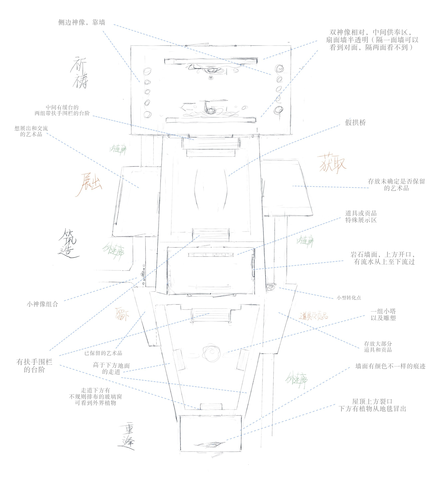

# 《诗人与岛》寺庙空间设计专业审核任务书

> **文件用途**：帮助受邀的空间／室内／建筑／游戏环境设计专业人士，在不了解项目的前提下快速理解项目目标，并对现有寺庙概念草图进行独立审核和重构建议。
>
> **当前状态**：外部专业审核输入，不是最终空间定案，也不是要求在现有草图上做表面装修。
>
> **版本日期**：2026-08-04

---

## 一、我们希望您帮助解决什么

我们正在设计一款名为《诗人与岛》（*Insula Artis*）的游戏。当前寺庙空间已有一张早期概念剖析图，但团队担心其中的空间分配、动线、视线、功能相邻关系和室内利用方式不够合理。

我们希望邀请您从专业角度完成两件事：

1. **独立诊断**：指出现有方案中真正不合理、低效、难以理解或难以落地的部分，并解释原因；
2. **提出更优布局**：在保留核心游戏体验的前提下，重新组织房间、路径、尺度、视线、焦点与功能区，而不是只给现有草图增加装饰。

这不是一项现实建筑施工委托。目标空间首先服务于实时 3D 游戏，但我们希望它具有可信的建筑与室内空间逻辑，让玩家不依赖大量文字说明也能理解自己在哪里、为什么来到这里、下一步应该去哪里。

如果您判断其中一部分问题更属于游戏关卡设计、镜头设计或实时 3D 交互，而不是传统室内设计，请明确指出，并建议需要哪类专业角色共同参与。

---

## 二、项目是什么

《诗人与岛》是一款以艺术感知和自我认识为核心的 AI 宠物艺术教育游戏。

玩家扮演一尊被岛民供奉的诗人神像：

- **白天**，上供者来到寺庙，与神像交谈并留下供品材料；玩家通过真实表达获得“记忆能量”；
- **夜晚**，玩家从神像中以独立灵体显现，亲自穿过寺庙，回收材料、与宠物完成共鸣，并管理收藏；
- 每次共鸣会形成一件绑定了载体、艺术品和材料来历的“记忆藏品”；
- 玩家决定归还或珍藏，并从记忆空间中挑选少数藏品放进实体展示柜；
- 这些选择逐渐形成一份可由玩家修改的个人艺术家画像。

项目不希望把寺庙做成三个并排的功能菜单。空间本身需要讲述从“被供奉”到“主动处理记忆”，再到“选择公开什么”的过程。

---

## 三、玩家在空间中的实际行为

### 1. 白天

- 玩家主体锚定在祈愿厅的神像；
- 上供者进入祈愿厅，与神像对话并留下供品；
- 玩家可以切换到三个房间管理员的预设观察位置，理解每个房间正在发生什么；
- 白天不是自由行走模式，空间主要通过四个具身视角被观察：神像、祈愿厅管理员、处理室管理员、陈列室管理员。

### 2. 夜晚

- 石像留在原地，玩家以独立灵体从神像旁出现；
- 玩家可以键盘行走或点击地面移动；
- 玩家先在祈愿厅回收供品材料；
- 再进入处理室，靠近宠物和处理装置，选择两件材料并消耗一点记忆能量完成共鸣；
- 玩家观看艺术内容，并可拿起载体进行 360°检视；
- 选择珍藏后，藏品进入“记忆空间”；
- 玩家继续走到陈列室，靠近实体展示柜完成策展。

### 3. 一次完整的夜间主路径

```text
神像旁显现
  → 在祈愿厅回收供品
  → 找到通往处理室的路径
  → 靠近宠物完成共鸣
  → 观看／甄选记忆藏品
  → 进入陈列室
  → 靠近展示柜调整陈列
  → 继续探索或返回
```

这条路径会反复发生，因此不仅要“第一次走得通”，还要考虑重复游玩时的距离、节奏、回程、捷径和空间疲劳。

---

## 四、三个核心功能空间

目前使用的名称都是工作称，专业审核可以建议更合适的空间组织和命名。

| 空间 | 主要任务 | 关键对象 | 需要建立的感受 |
|---|---|---|---|
| 祈愿厅 | 白天接待、对话、供品交接；夜晚回收材料 | 神像、上供者、供品区、祈愿厅管理员 | 公共、可进入、具有仪式感，但不压迫 |
| 处理室 | 夜晚材料成形、共鸣和艺术显现 | 宠物、处理装置、材料工作区、处理室管理员 | 私密、活跃、具有转化过程和工作感 |
| 陈列室 | 从收藏中选择少数藏品进行实体展示 | 展示柜、三处当前展示位、陈列室管理员 | 克制、可观看、有策展感，而不是仓库 |

### 需要特别区分的两个概念

- **记忆空间**：夜晚打开的内在收藏背包，是 UI／精神空间，不是寺庙里的第四间实体仓库；
- **陈列室**：寺庙中的真实房间，只展示玩家从记忆空间中主动挑出的少量藏品。

因此，不需要为“全部收藏”在建筑中安排无限储藏面积；但陈列室仍需要可信的观看距离、操作位置、灯光焦点和进出动线。

---

## 五、现有概念图



原文件：`概念图/e3f12ba5116d8462683cee8321ed9665.jpg`

### 这张图目前表达了什么

依据图中可见标注，我们理解其意图大致为：

- 把寺庙组织成纵向连续的三段体验，图中手写语义接近“祈祷／筑造／重逢”；
- 上段包含侧墙神像、相对的双神像、中央供奉区、半透明扇面墙、带扶手的平台、艺术品和假拱桥；
- 中段包含高低走道、保留或待决定的艺术品、道具与供品、储藏、流水岩壁、植物、小型转化点和小塔／雕塑；
- 下段包含已保留艺术品、带扶手平台、抬高走道、下方不规则玻璃窗、墙面痕迹、屋顶裂口与植物；
- 不同空间试图用台阶、桥、走道、玻璃、流水、岩壁和植物制造仪式性与探索感。

### 这张图没有确定什么

目前图中没有足够信息确定：

- 真实或相对尺度；
- 玩家／灵体／上供者的体型基准；
- 主入口、出口、回程和疏散逻辑；
- 墙厚、净高、门洞宽度、平台高差与坡度；
- 固定家具、可移动展品和装饰物的边界；
- 各功能的操作半径、观看距离和储藏深度；
- 四个白天镜头的视线范围；
- 夜晚跟随镜头的净空、遮挡和转向需求；
- 一次只容纳一名玩家还是需要表现多名上供者同时到访；
- 图中的桥、玻璃、流水与平台是功能构件还是氛围构件。

请不要把图上的形状、比例和物件位置视为不可改变的条件。

---

## 六、必须保留的体验约束

以下内容是空间审核需要服务的产品目标。它们限定“空间必须完成什么”，不限定“空间必须长什么样”。

1. 玩家能理解祈愿、处理、陈列三种不同功能，并能在它们之间移动；
2. 白天四个预设视角都能看清当前身份、所在房间和关键对象；
3. 夜晚灵体能够连续移动，不依赖传送菜单完成主循环；
4. 供品、宠物和展示柜都要求玩家亲自抵达并靠近，不能跨房间远程操作；
5. 空间需要支持“祈愿厅回收 → 处理室共鸣 → 陈列室策展”的叙事顺序；
6. 神像在白天是主要身份锚点，夜晚灵体离开后石像仍留在原位；
7. 每个实体房间有一名管理员作为白天观察锚点，但管理员不替玩家行动；
8. 陈列室是少量展示与重新观看的空间，不是全部收藏的仓库；
9. 门洞、地标、光线、材质或高差需要提供方向感，不能只靠 HUD 文字导航；
10. 空间应兼容键盘行走、点击地面寻路、跟随镜头和近距离点击交互；
11. 常规藏品与特殊藏品都能被平等陈列，空间不应用位置或灯光把常规结果表现成失败品；
12. 整体气质应支持虚构、诗性、艺术教育和记忆收藏，不做现实宗教建筑复刻。

---

## 七、允许并鼓励挑战的内容

只要不破坏上述体验目标，以下内容都可以被重新设计：

- 三个房间是否必须严格排成一条直线；
- 房间的长宽比、面积占比、层高和高差；
- 入口、出口、回程、环路、捷径和视线穿透；
- 房间之间使用门洞、庭院、廊桥、坡道、楼梯还是其他过渡；
- 神像、管理员、宠物、供品区和展示柜的具体位置；
- 图中的双神像、扇面墙、假拱桥、流水、玻璃窗、平台和栏杆是否保留；
- 展示区是集中柜体、壁龛、岛台、回廊还是混合形式；
- 是否需要前厅、缓冲区、半室外空间、后勤暗区或视觉上的“不可进入区”；
- 三个工作称是否应改名，以及空间叙事是否需要重新分段。

如果您认为现有“纵向三段式”本身就是问题，可以提出替代邻接关系；请同时说明替代方案如何保留完整的昼夜行动和叙事因果。

在团队正式确认之前，替代邻接关系只作为专业提案，不会自动取代当前“纵向连续三空间”的设计权威或直接进入代码。

---

## 八、团队目前怀疑的问题

以下是团队的初步疑点，**不是预设结论**。请逐条确认、反驳或补充，并给出专业依据。

### 1. 功能与面积

- 中段似乎同时承担处理、储藏、道具展示、未决定艺术品、流水景观和转化点，可能过载；
- 上段也出现艺术品展示，与最终陈列室的职责可能重叠；
- 边缘放置大量物件，但没有表现操作面、观看距离、储藏深度和维护空间；
- 房间面积似乎由图形构图决定，而不是由使用人数、停留时长和操作需求推导。

### 2. 动线与重复游玩

- 三段线性串联可能让玩家反复走同一条长通道；
- 当前没有明确环路、回程、捷径或第二出口；
- 台阶、扶手、桥和高低走道可能增强氛围，也可能切碎可行走面并增加碰撞；
- 处理结束后去陈列室的路径是否自然，以及陈列后下一步去哪里，目前不清楚。

### 3. 视线与空间辨识

- 双神像、半透明扇面墙、侧墙神像和中央供奉区可能互相争夺主焦点；
- 连续狭长空间可能在镜头中看起来像重复走廊，而不是三个有性格的房间；
- 多层平台、栏杆和局部墙体可能遮挡玩家、管理员、供品、宠物或展示柜；
- 图中没有明确说明玩家站在哪里能看到下一空间、回头时能看到什么。

### 4. 游戏镜头与交互

- 白天四个固定观察点需要足够的构图纵深和无遮挡视野；
- 夜晚跟随镜头需要转身、后退、过门和上下高差的净空；
- 狭窄门洞、透明隔断、栏杆和小型装饰可能造成点击、寻路和射线命中问题；
- 交互对象周围需要同时容纳玩家模型、镜头、提示和操作反馈，而不只是物件本身放得下。

### 5. 建筑逻辑与氛围构件

- 流水、岩壁、植物、玻璃、屋顶裂缝和假拱桥的空间作用尚不明确；
- 如果所有区域都同时使用强烈景观构件，房间之间可能失去层级；
- 如果这些元素没有结构、排水、采光或叙事逻辑，可能只剩表面装饰；
- 现实可建性不是首要目标，但空间仍应让玩家相信它能被使用、维护和长期存在。

---

## 九、希望您重点审核的专业问题

请尽量用图示和因果说明回答，而不只给审美意见。

1. 三个功能空间最合理的邻接关系是什么？线性、环形、中心辐射、庭院式或分层式各有什么代价？
2. 三个空间的面积、长宽比和高度应该如何分配？哪些功能决定其最小尺寸？
3. 主入口、夜间起点、处理点、展示终点和回程之间应如何组织？
4. 哪些地方应该建立视线穿透，哪些地方应该遮蔽以制造发现感？
5. 神像、管理员、宠物、供品和展示柜分别应成为怎样的视觉锚点？
6. 如何让三个房间一眼可区分，又保持属于同一座寺庙？
7. 现有台阶、平台、扶手、桥、半透明隔断和高差有哪些必要，哪些应删减？
8. 如何安排观看距离、交互半径、镜头净空和可行走面，避免遮挡、死角与碰撞？
9. 祈愿厅与陈列室都涉及“被观看”，怎样避免功能重复？
10. 处理室怎样同时容纳工作、转化、等待和艺术显现，而不变成杂物仓库？
11. 展示柜应如何布局，才能既有策展感，又支持玩家靠近、拿起、检视和更换藏品？
12. 哪些空间问题可以通过关卡设计解决，哪些必须从建筑／室内布局上重做？
13. 当前方案最应该优先修改的三个问题是什么？如果不改，会造成什么玩家体验后果？

---

## 十、期望交付物

我们希望最终得到的是可用于下一轮游戏场景重建的设计依据，而不是只有氛围图。

### 最低交付

1. **现有图纸批注版**：用编号标出问题、影响和建议；
2. **功能邻接图**：说明三个核心房间及必要缓冲区如何连接；
3. **动线图**：分别画出白天上供者、白天四个观察视角、夜晚玩家灵体三条路径；
4. **视线与焦点图**：标明主要视觉锚点、需要穿透和需要遮蔽的位置；
5. **问题优先级表**：按“必须改／建议改／可保留”分类；
6. **一套推荐布局**：至少给出相对比例、关键尺寸假设和每个区域的功能说明。

### 推荐交付

1. **两个方案对比**：
   - A：保留三段纵向结构的低成本优化；
   - B：允许改变邻接关系的重构方案；
2. **关键空间剖面或轴测图**：解释高差、层高、桥、平台、玻璃、流水或庭院关系；
3. **镜头与交互检查**：标出固定观察点、跟随镜头转向空间和主要交互半径；
4. **房间设计说明**：逐间解释功能、氛围、材质、光线、声场和地标；
5. **仍需团队回答的问题清单**：明确哪些尺寸或设计决定因信息不足暂不能下结论。

交付格式可为标注 PDF／JPG 加文字说明；若使用 CAD、SketchUp、Blender、Rhino 或其他源文件，请同时提供可普遍查看的 PDF 或图片版本。

---

## 十一、请明确写出您的假设

当前项目尚未确定以下参数，请不要默默替团队做永久决定：

- 最终画风和材质精度；
- 玩家灵体、管理员与上供者的标准身高；
- 房间的绝对尺寸和层高；
- 摄像机视场角、最近距离和是否允许穿透部分墙体；
- 单次同时出现的上供者数量；
- 是否需要适配移动端触控；
- 是否需要按现实公共建筑规范校核无障碍、疏散与消防；
- 未来是否会把游戏空间转化为线下展览或实体体验。

请在方案开头列出所采用的尺度、人数、视角和使用场景假设。若某项假设会显著改变布局，请给出分支方案或说明需要团队先决定什么。

---

## 十二、我们如何判断建议是否有效

一套更好的空间方案应当让以下问题更容易回答“是”：

- 玩家第一次进入时，能否不看说明就理解主要空间和去向？
- 白天四个观察点能否各自形成清楚、有区别的构图？
- 夜晚从祈愿厅到处理室再到陈列室的行动是否自然，而不是漫长跑腿？
- 重复多次后，路线是否仍有节奏和选择，而不是机械折返？
- 关键对象是否容易发现、靠近和操作？
- 镜头是否有足够空间，不频繁穿墙、被栏杆遮挡或丢失玩家？
- 三个房间是否各有功能和情绪，同时属于同一个整体？
- 空间是否表达“记忆被接收、处理和选择性展示”，而不是普通仓库、商店或合成工厂？
- 装饰构件是否有空间和叙事作用，而不是堆叠概念？
- 方案是否保留后续扩展角色、供品、藏品和事件的余量？

---

## 十三、建议的沟通顺序

为降低返工，建议按以下顺序合作：

1. 专家先独立阅读本任务书和现有概念图；
2. 提交第一轮问题清单和对现有方案的初步诊断；
3. 团队只回答会显著影响布局的关键问题；
4. 专家提交邻接关系与动线草案；
5. 团队确认体验方向后，再深化比例、构图、材质和氛围；
6. 场景进入游戏原型后，再以真实截图和录屏检查镜头、遮挡、导航和画风。

我们更重视“为什么这样布局”和“它解决了什么玩家问题”，而不是单纯追求复杂、宏大或视觉奇观。

---

## 十四、配套资料

如需进一步了解项目，项目组可按需提供以下配套资料：

1. 《项目最高设计权威》：项目定位、玩家身份与空间硬约束；
2. 《系统机制》：昼夜行为、房间功能和交互流程；
3. 《世界观与项目本质》：寺庙的叙事意义；
4. 《事件剧本》：玩家第一个昼夜的实际行动；
5. 《庙宇管理员设定》：三个管理员与白天观察视角；
6. 《可玩产品原型视觉与交互验收规范》：方案进入原型后的视觉和交互验收要求。

这些文件提供设计背景，但不要求空间专家维护项目文档。若内容之间出现冲突，请在反馈中指出，不要自行选择其中一版作为最终答案。
